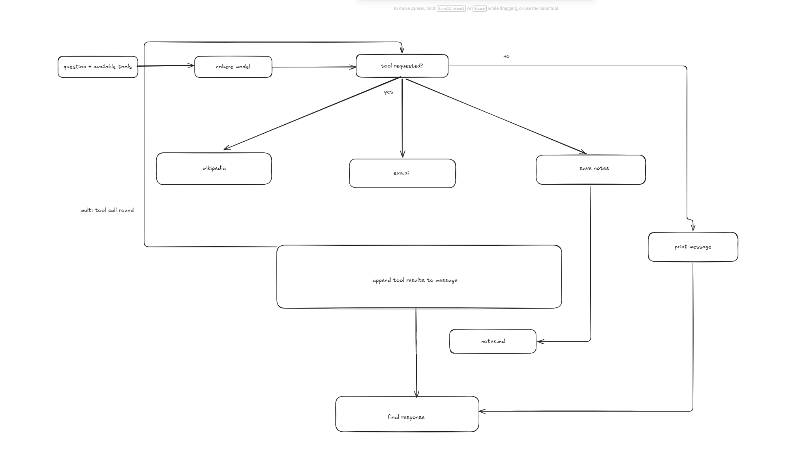

# cohere research tool

# design schema

# core features
- cohere command a plus model
- cohere rerank model
- system prompt for saving token usage
- 3 tool calls
    - exa tool for up to date research
    - wikipedia api for background knowledge
    - save notes of research (markdown)
- agentic loop for thinking (max iterations = 5)
- simple ui on separate branch
    - to run streamlit ui 
        - .\venv\Scripts\Activate.ps1 
        - streamlit run streamlit_app.py

# architecture decisions
- single tool call round vs chaining multiple tool calls 
    - I originally started out with a single tool call but i quickly realized i was tunneled into either a wikipedia or exa backed response and i was also unable to save the response to my notes so i refactored to chain multiple tool calls together with a max iteration of 5 to avoid infinite tool calls. 
- hardcode vs system prompt
    - I added a system prompt to guide the model to call the correct tool to avoid unnecessary token consumption. This way exa was only called if up-to-date info was needed. Additionally, save notes was intentionally left to be called last since its only needed once the model has gathered all the tool results and formed a response
- protection against path/directory traversal vulnerability 
    - model can hallucinate or be manipulated and attempt to save notes files outside of notes folder so protection was added to avoid that
- added rerank 
    - trims exas 10 results down to top 3
    - trims wikipedias top 5 results down to 1 
    - less noise in document content sent to cohere model so tighter context and info more accurate

agentic systems
1. define functions for tools
2. create a function map used to map string to actual function name
3. tools schema
4. messages
5. initial cohere bot call (sending question + available tools)
6. see if any tools were called
7. second cohere bot call (og question + available tools + what tool gave back to us)
8. cohere bot reads everything and formulates a response
9. sends us response